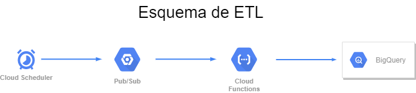

# Data Engineer - Challenge
This is the Basic Challenge for Dathttps://github.com/jicp/walmart/blob/main/README.mda Engineers. 

## Autor
Jaime Campos Perez

## Descripcion del trabajo realizado

Se realizó un procesamiento de datos ETL, para el conjunto de datos proporcionado.




Se realizaron las siguientes tareas en la solución del problema planteado:

* Se implementó un servicio de cron en GCP (Scheduler).
* Se implementó un servicio de mensajería de GCP (Pub/Sub).
* Se implementó una aplicacion sin servidor de GCP (Cloud Functions), dejando los datos en BigQuery de GCP.
* Se crearon las consultas de datos en BigQuery.
* Se disponibilizaron los reportes solicitados en Data Studio de GCP.
* Se diponibilizaron los datos globales y de las consutas en Github.

## Consideraciones

Se disponía de 2 variables de analisis para el conjunto de datos: 'Meta' y 'User'. 

Al no existir información sobre cual utilizar,se realizaron los dos análisis.

Los conjuntos de datos no eran totalmente compatibles, ya que la valoración de ‘User’ contenía valores sin calificar. Por este motivo se trabajaron como conjuntos de datos por separado.

- Debido a lo simple de las transformacion en los datos, no fue necesario utilizar Dataprep.
- Debido a la simplicidad del proceso no fue necesario utilizar Airflow para controlar las etapas del procesamiento.
- Debido a que la cantidad de datos eran reducidos, no fue necesario utilizar Databricks.


## Resultados

Los resultados pueden ser visualizados en https://datastudio.google.com/reporting/1fa7ad84-d82b-43fb-99b4-04c692d0920c

Los datos están disponibles en [Github](output)


## Cloud Function
```python
import base64
import pandas as pd
import requests
from google.cloud import bigquery
from io import StringIO
from datetime import datetime

client = bigquery.Client()

def main_pubsub(event, context):

    url = "https://raw.githubusercontent.com/walmartdigital/de-challenge/main/data/consoles.csv"
    df_consoles = pd.read_csv(url)

    url = "https://raw.githubusercontent.com/walmartdigital/de-challenge/main/data/result.csv"
    df_result = pd.read_csv(url)

    df_consoles['console'] = df_consoles['console'].str.strip()
    df_result['console'] = df_result['console'].str.strip()
    df_result['fecha'] = pd.to_datetime(df_result['date'])
    df_result['ano'] = pd.DatetimeIndex(df_result['fecha']).year
    df_result['mes'] = pd.DatetimeIndex(df_result['fecha']).month
    df_result['dia'] = pd.DatetimeIndex(df_result['fecha']).day
    df_result.rename(columns={'name': 'game'}, inplace=True)
    df_result["userscore"] = pd.to_numeric(df_result["userscore"], errors='coerce')
    df_ventas = pd.merge(df_result, df_consoles ,on="console")

    df_meta = df_ventas[['company','game','console','metascore','fecha','ano','mes']].copy()
    df_user = df_ventas[['company','game','console','userscore','fecha','ano','mes']].copy()
    df_user.dropna(inplace=True)
    df_user['userscore'] = df_user['userscore'].astype('float')
    df_user['ano'] = df_user['ano'].astype('int64')
    df_user['mes'] = df_user['mes'].astype('int64')

    df_meta['metascore'] = df_meta['metascore'].astype('int64')
    df_meta['ano'] = df_meta['ano'].astype('int64')
    df_meta['mes'] = df_meta['mes'].astype('int64')

    # df_user = df_user[df_user['company']=='PC']
    # df_meta = df_meta[df_meta['company']=='PC']
    
    job_config = bigquery.LoadJobConfig(
        schema=[
            bigquery.SchemaField("company", bigquery.enums.SqlTypeNames.STRING),
            bigquery.SchemaField("game", bigquery.enums.SqlTypeNames.STRING),
            bigquery.SchemaField("console", bigquery.enums.SqlTypeNames.STRING),
            bigquery.SchemaField("userscore", bigquery.enums.SqlTypeNames.FLOAT64),
            bigquery.SchemaField("fecha", bigquery.enums.SqlTypeNames.DATE),
            bigquery.SchemaField("ano", bigquery.enums.SqlTypeNames.INT64),
            bigquery.SchemaField("mes", bigquery.enums.SqlTypeNames.INT64),
        ],
        write_disposition="WRITE_TRUNCATE",
    )

    table_id = "walmart-300819.DataWalmart.TableUser"

    job = client.load_table_from_dataframe( df_user[['company','game','console','userscore','fecha','ano','mes']], table_id, job_config=job_config    ) 
    job.result()  
    table = client.get_table(table_id)
    
    job_config = bigquery.LoadJobConfig(
        schema=[
            bigquery.SchemaField("company", bigquery.enums.SqlTypeNames.STRING),
            bigquery.SchemaField("game", bigquery.enums.SqlTypeNames.STRING),
            bigquery.SchemaField("console", bigquery.enums.SqlTypeNames.STRING),
            bigquery.SchemaField("metascore", bigquery.enums.SqlTypeNames.INT64),
            bigquery.SchemaField("fecha", bigquery.enums.SqlTypeNames.DATE),
            bigquery.SchemaField("ano", bigquery.enums.SqlTypeNames.INT64),
            bigquery.SchemaField("mes", bigquery.enums.SqlTypeNames.INT64),
        ],
        write_disposition="WRITE_TRUNCATE",
    )

    table_id = "walmart-300819.DataWalmart.TableMeta"

    job = client.load_table_from_dataframe( df_meta[['company','game','console','metascore','fecha','ano','mes']], table_id, job_config=job_config    ) 
    job.result()  
    table = client.get_table(table_id)

    pubsub_message = "ok"
    print(pubsub_message)
 ```

## Consultas Big Query - Meta
Estas consultas son realizadas para el despliegue en Data Studio

The top 10 best games for each console/company.
```sql
select concat(console,'/',company) as console_company,game, metascore from (
select console,company,game, metascore,row_number() over (partition by console,company order by metascore desc) as ranking 
from `walmart-300819.DataWalmart.TableMeta`
) as resumen
where ranking<=10
order by console,company,metascore desc
```
The worst 10 games for each console/company.
```sql
select concat(console,'/',company) as console_company,game, metascore from (
select console,company,game, metascore,row_number() over (partition by console,company order by metascore ) as ranking 
from `walmart-300819.DataWalmart.TableMeta`
) as resumen
where ranking<=10
order by console,company,metascore
```
The top 10 best games for all consoles.
```sql
select console,company,game, metascore
from `walmart-300819.DataWalmart.TableMeta`
order by metascore desc
limit 10
```
The worst 10 games for all consoles
```sql
select console,company,game, metascore
from `walmart-300819.DataWalmart.TableMeta`
order by metascore 
limit 10
```


## Consultas Big Query - User
Estas consultas son realizadas para el despliegue en Data Studio

The top 10 best games for each console/company.
```sql
select concat(console,'/',company) as console_company,game, userscore from (
select console,company,game, userscore,row_number() over (partition by console,company order by userscore desc) as ranking 
from `walmart-300819.DataWalmart.TableUser`
) as resumen
where ranking<=10
order by console,company,userscore desc
```
The worst 10 games for each console/company.
```sql
select concat(console,'/',company) as console_company,game, userscore from (
select console,company,game, userscore,row_number() over (partition by console,company order by userscore ) as ranking 
from `walmart-300819.DataWalmart.TableUser`
) as resumen
where ranking<=10
order by console,company,userscore
```
The top 10 best games for all consoles.
```sql
select console,company,game, userscore
from `walmart-300819.DataWalmart.TableUser`
order by userscore desc
limit 10
```
The worst 10 games for all consoles
```sql
select console,company,game, userscore
from `walmart-300819.DataWalmart.TableUser`
order by userscore 
limit 10
```


